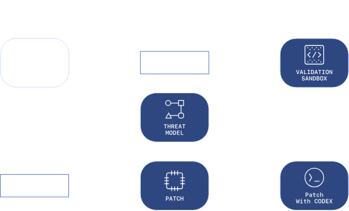

Aardvark: агент-аналитик по информационной безопасности от OpenAI
На стадии закрытого бета-тестирования: агент ИИ, который думает как аналитик по информационной безопасности и масштабируется в соответствии с требованиями современного программного обеспечения.
Сегодня мы объявляем о запуске Aardvark, агента-аналитика по информационной безопасности на базе GPT‑5.

Безопасность программного обеспечения — одна из самых критически важных и сложных областей в технологии. Десятки тысяч новых уязвимостей ежегодно обнаруживаются в корпоративных и открытых базах исходного кода. Перед антивирусными программами стоит сложная задача обнаружения и устранения уязвимостей до того, как это сделают перехватчики. Мы в компании OpenAI работаем над тем, чтобы помогать антивирусному ПО справляться с поставленной задачей.

Aardvark представляет собой прорыв в области ИИ и исследований по безопасности. Это автономный агент, который может помогать разработчикам и командам безопасности обнаруживать и устранять уязвимости в любом масштабе. Aardvark уже доступен в режиме закрытого бета-тестирования для проверки и уточнения его возможностей.

Как работает Aardvark
Aardvark постоянно анализирует репозитории исходного кода для выявления уязвимостей, оценки их перспективности, определения приоритетов по степени серьезности и предложения конкретных исправлений.

Aardvark отслеживает коммиты и изменения в базах исходного кода, выявляя уязвимости, способы их эксплуатации и предлагая исправления. Aardvark не использует традиционные методы анализа программ, такие как фаззинг (нечеткое тестирование) или анализ композиции программного обеспечения. Вместо этого система использует режим рассуждений на основе LLM, а также инструменты для понимания поведения кода и выявления уязвимостей. Aardvark ищет ошибки так же, как это делает настоящий аналитик по информационной безопасности: он читает код, анализирует его, создает и выполняет тестирование, использует инструменты и т. д.

В системе Aardvark используется многоступенчатый процесс для выявления, объяснения и устранения уязвимостей.

Анализ: сначала система проводит анализ всего репозитория для создания модели угрозы, отражающей понимание целей по обеспечению безопасности и дизайна проекта.
Сканирование коммитов: система проверяет уязвимости, анализируя изменения на уровне коммитов по всему репозиторию и модели угрозы по мере добавления нового кода. При первом подключении репозитория Aardvark просканирует его журнал, чтобы выявить существующие проблемы. Aardvark объясняет найденные уязвимости шаг за шагом, оставляя примечания к коду для проверки специалистом.
Проверка: обнаружив потенциальную уязвимость, Aardvark попытается активировать ее в изолированной среде, чтобы подтвердить ее перспективность. Aardvark описывает предпринятые меры, чтобы предоставить пользователям точную, высококачественную информацию с низким количеством ложноположительных результатов.
Исправления: Aardvark интегрируется с OpenAI Codex, чтобы устранить обнаруженные уязвимости. Для каждой обнаруженной уязвимости Aardvark создает в Codex исправление, проверяет его и отправляет на проверку специалистом. И все это одним щелчком мыши.
Aardvark работает вместе с разработчиками, интегрируясь с GitHub, Codex и существующими рабочими процессами, чтобы предоставлять четкие и применимые на практике данные, не замедляя при этом разработку. Aardvark разработан для обеспечения безопасности, но в ходе тестирования мы обнаружили, что он также может выявлять такие ошибки, как логические изъяны, неполные исправления и проблемы с конфиденциальностью.

Реальное воздействие
Aardvark был запущен несколько месяцев назад и непрерывно функционирует на внутренних базах исходного кода OpenAI и на базах внешних партнеров по альфа-тестированию. В OpenAI системой были выявлены значительные уязвимости, что способствовало укреплению защитных механизмов OpenAI. Партнеры подчеркнули глубину анализа: Aardvark выявляет проблемы, возникающие только в сложных условиях.

В ходе эталонного тестирования на «золотых» репозиториях Aardvark выявил 92% известных и синтетически внедренных уязвимостей, продемонстрировав высокий отклик и реальную эффективность.

Aardvark для открытого исходного кода
Aardvark также применялся в проектах с открытым исходным кодом, где он обнаружил множество уязвимостей, о которых мы сообщили, десять из которых получили идентификаторы Common Vulnerabilities and Exposures (CVE) (распространенные уязвимости и воздействия).

Будучи бенефициарами открытых исследований, проводимых в течение десятилетий, и добросовестного раскрытия информации, мы стремимся вносить свой вклад в виде инструментов и результатов, которые обеспечивают безопасность цифровой экосистемы. Мы планируем предлагать возможность бесплатного сканирования для отдельных некоммерческих репозиториев с открытым исходным кодом, чтобы обеспечивать безопасность экосистемы открытого программного обеспечения и цепочки поставок.

Недавно мы обновили⁠ нашу политику внешнего координированного раскрытия уязвимостей⁠, которая поддерживает разработчиков и ориентирована на сотрудничество и воздействие в масштабе, а не на жесткие сроки раскрытия, которые могут давить на разработчиков. Мы считаем, что такие инструменты, как Aardvark, помогут обнаруживать все большее количество ошибок, и мы хотим поддерживать экологичное сотрудничество с целью повышения устойчивости систем в долгосрочной перспективе.
Почему это имеет значение
Программное обеспечение теперь является основой каждой отрасли, что означает, что уязвимости представляют собой системный риск для бизнеса, инфраструктуры и общества. Только в 2024 году было зарегистрировано более 40 000 распространенных уязвимостей. Наше тестирование показывает, что около 1,2% коммитов содержат ошибки, а это небольшие изменения, которые могут иметь значительные последствия.

Aardvark представляет собой новую модель, для которой защита в приоритете: агент-аналитик по информационной безопасности, который сотрудничает с командами, обеспечивая непрерывную защиту по мере развития кода. Выявляя уязвимости на ранней стадии, проверяя их реальную перспективность и предлагая конкретные варианты исправления, Aardvark может повысить безопасность, не замедляя инновации. Мы верим в возможность расширения доступа к знаниям в области безопасности. Мы начинаем с закрытого бета-тестирования и будем расширять доступность системы по мере накопления опыта.